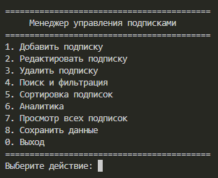
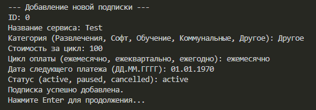
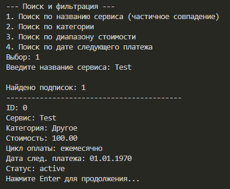
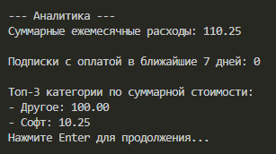

# SubscriptionTracker

**ФИО: Пинчук Богдан, Тимур Агаев**<br>**Группа: 9ИС-345**

## Цель работы
Закрепить навыки объектно-ориентированного программирования, работы со стандартной библиотекой STL, файлового ввода-вывода, проектирования модульных приложений и обработки пользовательского ввода в среде C++.

## Постановка задачи
Разработать консольное приложение для учёта и управления регулярными подписками и автоматическими платежами. Программа обеспечивает добавление, редактирование, удаление записей, поиск и фильтрацию, сортировку, расчёт финансовых показателей, а также сохранение и загрузку данных в текстовом формате TXT.

## Технические требования
- Язык: C++17
- Хранение данных: `std::vector`
- Формат файла: TXT с разделителем (id,service_name,category,monthly_cost,billing_cycle,next_payment_date,status)
- Обработка ошибок ввода: без аварийного завершения
- Корректное отображение кириллицы в Windows (SetConsoleOutputCP(65001))

## Структура проекта
```
SubscriptionTracker/
├── src/
│   ├── main.cpp
│   ├── Subscription.h / Subscription.cpp
│   ├── SubscriptionManager.h / SubscriptionManager.cpp
│   ├── FileIO.h / FileIO.cpp
│   └── Menu.h / Menu.cpp
├── data/
│   └── subscriptions.txt
├── CMakeLists.txt
└── README.md
```

## Инструкция по установке

### Windows
1. Откройте Developer Command Prompt for VS или PowerShell с Visual Studio
2. Клонируйте репозиторий
3. Выполните:
```powershell
mkdir build
cd build
cmake .. -G "Visual Studio 17 2022"
cmake --build . --config Release
```
4. Запустите: `.\Release\SubscriptionTracker.exe`

### Linux
```bash
mkdir build && cd build
cmake ..
make
./SubscriptionTracker
```

## Функциональность

### Управление данными (CRUD)
- Добавление подписки с уникальным идентификатором
- Редактирование существующей записи
- Удаление подписки по ID или названию сервиса
- Валидация: стоимость > 0, цикл оплаты из допустимого перечня, дата в формате ДД.ММ.ГГГГ, непустые строки, уникальный ID

### Поиск и фильтрация
- По названию сервиса (частичное совпадение, регистронезависимо)
- По категории (Развлечения, Софт, Обучение, Коммунальные, Другое)
- По диапазону стоимости
- По дате следующего платежа (от–до)

### Сортировка
- По месячной стоимости подписки (возрастание/убывание)
- По дате следующего платежа
- По алфавиту (название сервиса)

### Аналитика
- Суммарные ежемесячные расходы по всем активным подпискам
- Вывод списка подписок с датой оплаты в ближайшие 7 дней
- Топ-3 категории по суммарной стоимости активных подписок

### Работа с файлами
- Автоматическая загрузка `data/subscriptions.txt` при старте
- Ручное сохранение изменений по команде пользователя

## Скриншоты работы






## Комментарии к проекту
- Использован `std::filesystem` для создания директорий при сохранении
- Все пользовательские вводы валидируются без аварийного завершения программы
- Поддерживаются циклы оплаты: ежемесячно, ежеквартально, ежегодно
- Статусы подписок: active, paused, cancelled